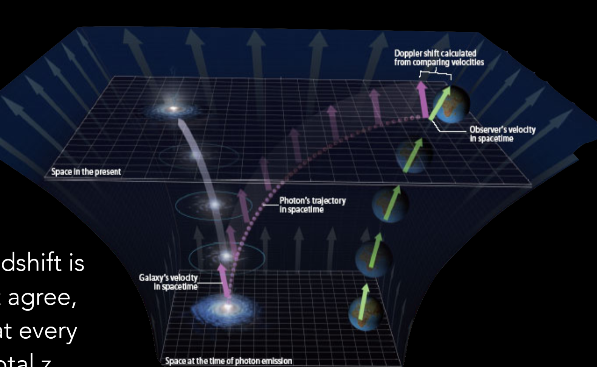

import { Image } from 'astro:assets';

import Accordion from '../../../../components/Accordion.astro';
import RadioQuestion from '../../../../components/RadioQuestion.astro';
import RadioQuestionAnswer from '../../../../components/RadioQuestionAnswer.astro';


<RadioQuestion question="Where does the energy go when photons are redshifted by the expansion of the universe?">
    <RadioQuestionAnswer content="A">**Nowhere:** the wavelength is just being measured by galaxies that were initially receding from the source.</RadioQuestionAnswer>
    <RadioQuestionAnswer content="B">**Converted:** it is converted to gravitational potential energy as it is climbing out of a universe that was denser in the past.</RadioQuestionAnswer>
    <RadioQuestionAnswer content="C">**Lost:** energy is not conserved in the expanding universe.</RadioQuestionAnswer>
    <RadioQuestionAnswer content="D">All of the above.</RadioQuestionAnswer>
</RadioQuestion>


## Intuition

It certainly seems like energy is not conserved.

With the following energy density evolutions,


{/* 
For customising colours, I'd pick 300/400 from https://tailwindcss.com/docs/customizing-colors
For changing size and style, see https://katex.org/docs/supported.html#style-color-size-and-font 
*/}


```math
\huge
\begin{aligned}
\color{#2dd4bf}   \rho_M       &=  \color{#2dd4bf} \rho_{M_0} a^{-3} \\
\color{#f87171}   \rho_R       &=  \color{#f87171} \rho_{R_0} a^{-4} \\
\color{#22d3ee}   \rho_\Lambda &=  \color{#22d3ee} \rho_{\Lambda_0}
\end{aligned}
```

it certainly seems that as our universe expands, the total energy indeed changes:


```math
\huge
\begin{aligned}
\color{#2dd4bf}    E_M          &=   \color{#2dd4bf}  E_{M_0} \\
\color{#f87171}    E_R          &=   \color{#f87171}  E_{R_0} a^{-1} \\
\color{#22d3ee}    E_\Lambda    &=   \color{#22d3ee}  E_{\Lambda_0} a^3
\end{aligned}
```

Additionally, if we discuss Noether's theorem, energy conservation happens only when there is time symmetry. So we should we expect 
energy to be conserved on a changing, non-time-symmetriic background? In GR, energy is not conserved when there is no timelike Killing vector.

But energy conservation *is* meaningful in GR, it is encapsulated in $\Delta T_{\mu\nu} = 0$.

## Deeper Dive

For a photon, <span class="text-amber-400">energy is conserved at every point along its path.</span>

* <span class="text-emerald-400">Locally,</span> space can be approximated by <span class="text-emerald-400">special relativity</span> (Minkowski space).
* <span class="text-red-400">Integrate over infinitesimal Doppler shifts</span> along the photon's path.

```math
\large
\begin{aligned}
v_{\text{SR}}   &=   c \frac{ (1+z)^2 - 1 }{ (1+z)^2 + 1 } \\\\
v_{\text{recession}}  &= H_0 R_0 c \int_0^z \frac{dz}{H(z)} \\
\end{aligned}
```

Often you will hear it said that cosmological redshift is 
not a Doppler shift, because these equations don't agree, 
but if you continuously apply a Doppler shift at every 
point along the photon's path you get the total redshift.



<Accordion title="hello">
    <p>world</p>
</Accordion>